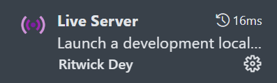
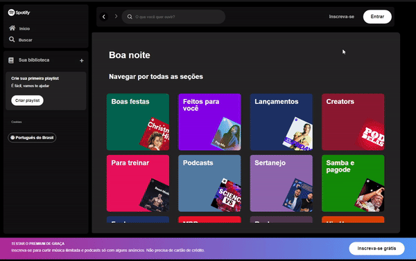

# spotify-clone-imersao-alura

Um clone do front-end da landing page do spotify, feito seguindo a imersão front end da Alura, Com algumas adições minhas como:

- Listagem de multiplos cards de artistas na busca
- Cards da tela principal populados por JavaScript

## Requisitos:

- Node.js versão 18.0.0 ou superior
- vscode
- live server extensão do vscode ou pacote node
- JSON Server versão 0.17.4

## Como rodar:

### instalando live server:

#### Pelo VSCode:



#### Pelo Node.js:

```bash
npm install -g live-server
cd <path da pasta do projeto>
live-server --port=5000
```

### instalando JSON Server:

```bash
npm install -g json-server@0.17.4
json-server --watch api-artists/artists.json --port:3000
```

# Preview do resultado:


